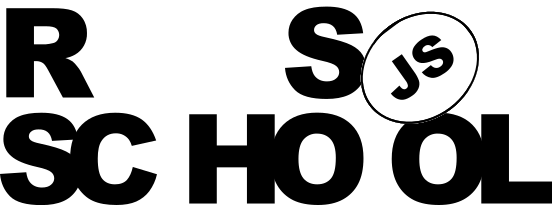

# Siarhei Ladorski
### Fullstack JS Developer


---

## Navigation
- [About Me](#about-me)
- [Contacts](#contacts)
- [Skills](#skills)
- [Code Example](#code-example)
- [Projects & Experience](#projects--experience)
- [Education & Languages](#education--languages)

---

## About Me
Highly motivated aspiring Fullstack JS Developer with a solid foundation in core web technologies. Passionate about creating clean, accessible, and responsive user interfaces. Fast learner, adaptable to new environments, and highly dedicated to writing clean, maintainable code following modern industry best practices.

---

## Contacts
* **Email:** <siarheiladorski@example.com>
* **Phone:** [+375 (29) 123-45-67](tel:+375291234567)
* **Telegram:** [@siarheiladorski](https://t.me/siarheiladorski)
* **Location:** Minsk, Belarus

---

## Skills

### Frontend Development
* JavaScript (ES6+)
* TypeScript
* React (Hooks, Redux Toolkit)
* HTML5 / CSS3 / SASS (SCSS)
* Responsive & Adaptive Design

### Backend & Databases
* Node.js
* Express.js
* REST API / GraphQL
* MongoDB / PostgreSQL

### Testing & API Tools
* Postman (API Testing & Automation)
* SoapUI (SOAP/REST Web Services)
* Jest / Vitest (Unit Testing)
* Swagger / OpenAPI (Documentation)

### Tools & DevOps
* Git & GitHub
* Webpack
* NPM
* Chrome DevTools & Debugging

---

## Code Example
Convert boolean values to strings 'Yes' or 'No'

```javascript
function boolToWord( bool ){
  return bool ? "Yes" : "No";
}
```

---

## Projects & Experience

### Rolling Scopes School - Training Projects
**2026 - Present**
* **CV Project:** Developed a fully semantic, valid HTML/CSS interactive curriculum vitae page.
* **Portfolio Website:** Built a responsive professional photographer landing page.

---

## Education & Languages

### Belarusian State University
* Degree in Computer Science | Graduation Year: 2024

### The Rolling Scopes School
* Course: Full-Stack JavaScript 2026 Q3 | 2026 - 2027

### English Language Level
**B2 (Upper-Intermediate)** — Confident speaking, reading technical documentation, and clear writing skills.

---

© 2026 [GitHub Profile](https://github.com/brujodelnorte) | <a href="https://rs.school/courses/javascript">
  
</a>